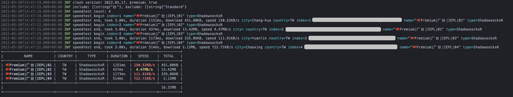

# Clash Speedtest


`Clash` 节点测速

## Usage

```
Usage:
  clash-speedtest [flags]

Flags:
      --debug              (env: SCS_DEBUG) show debug information
      --exclude strings    (env: SCS_EXCLUDE) filter nodes by exclude
  -h, --help               help for clash-speedtest
      --include strings    (env: SCS_INCLUDE) filter nodes by include
      --output string      (env: SCS_OUTPUT) output directory
      --proxy string       (env: SCS_PROXY) clash http proxy url (default "http://127.0.0.1:7890")
      --retry int          (env: SCS_RETRY) retry times when failed (default 3)
      --secret string      (env: SCS_SECRET) clash external controller secret
      --timeout duration   (env: SCS_TIMEOUT) timeout for http request (default 5s)
      --url string         (env: SCS_URL) clash external controller url (default "http://127.0.0.1:9090")
  -v, --version            version for clash-speedtest
```

### Docker


```bash
docker pull starudream/clash-speedtest
```

```bash
docker run --rm \
    --name clash-speedtest \
    -e SCS_DEBUG=true \
    -e SCS_URL=http://host.docker.internal:9090 \
    -e SCS_PROXY=http://host.docker.internal:7890 \
    starudream/clash-speedtest
```

## Screenshot



## License

[Apache License 2.0](./LICENSE)
